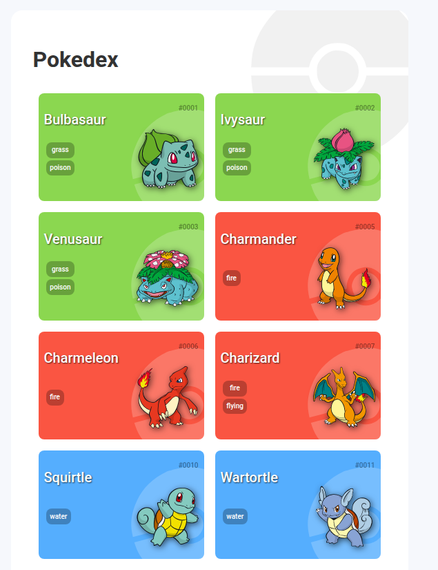

# Pokedex Web App

Este projeto é uma Pokédex desenvolvida em HTML, CSS e JavaScript puro, que consome a PokéAPI para listar Pokémons de forma paginada. O objetivo principal é exercitar conceitos de responsividade, consumo de APIs REST e manipulação de DOM.

## Demonstração



## Funcionalidades

- Listagem de Pokémons com nome, número, tipos e imagem.
- Tela de perfil com informações detalhadas sobre cada Pokémon.
- Botão "Carregar Mais" para paginação progressiva.
- Abas no perfil do Pokémon com:
  - Sobre (peso, altura, gênero e habilidades)
  - Base Stats
  - Dicas (fraquezas e forças com base no tipo principal)
- As **habilidades** agora possuem cor de fundo dinâmica baseada no **tipo principal** do Pokémon.
- Responsividade para diversos tamanhos de tela.

## Tecnologias Utilizadas

- HTML5
- CSS3
- JavaScript (ES6+)
- [PokéAPI](https://pokeapi.co/) para os dados dos Pokémons
- [Normalize.css](https://necolas.github.io/normalize.css/)
- [Google Fonts - Roboto](https://fonts.google.com/specimen/Roboto)

## Estrutura do Projeto

```
/
├── index.html
├── assets/
│   ├── css/
│   │   ├── global.css
│   │   └── pokedex.css
│   ├── js/
│   │   ├── pokemon-model.js
│   │   ├── poke-api.js
│   │   └── main.js
│   └── imgs/
│       └── pokeball.svg
```

## Como Executar Localmente

1. Clone este repositório:

   ```bash
   git clone https://github.com/seu-usuario/pokedex.git
   ```

2. Navegue até o diretório do projeto:

   ```bash
   cd pokedex
   ```

3. Abra o arquivo `index.html` no seu navegador:

   ```bash
   start index.html # No Windows
   open index.html  # No macOS
   xdg-open index.html # No Linux
   ```

## Fontes e APIs

- PokéAPI: [https://pokeapi.co/](https://pokeapi.co/)
- Normalize CSS: [https://cdnjs.com/libraries/normalize](https://cdnjs.com/libraries/normalize)
- Google Fonts (Roboto): [https://fonts.google.com/specimen/Roboto](https://fonts.google.com/specimen/Roboto)

## Contato

Desenvolvido por Leonardo Sabino. Para entrar em contato:

- LinkedIn: [Leonardo Sabino](https://www.linkedin.com/in/leonardo-sabino/)

## Licença

Este projeto é de uso livre para fins educacionais.
